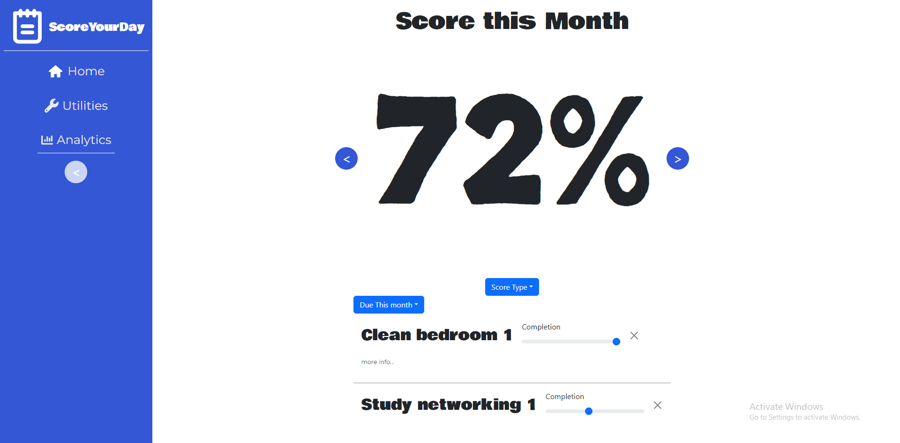
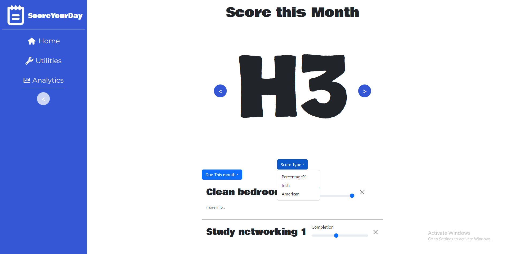
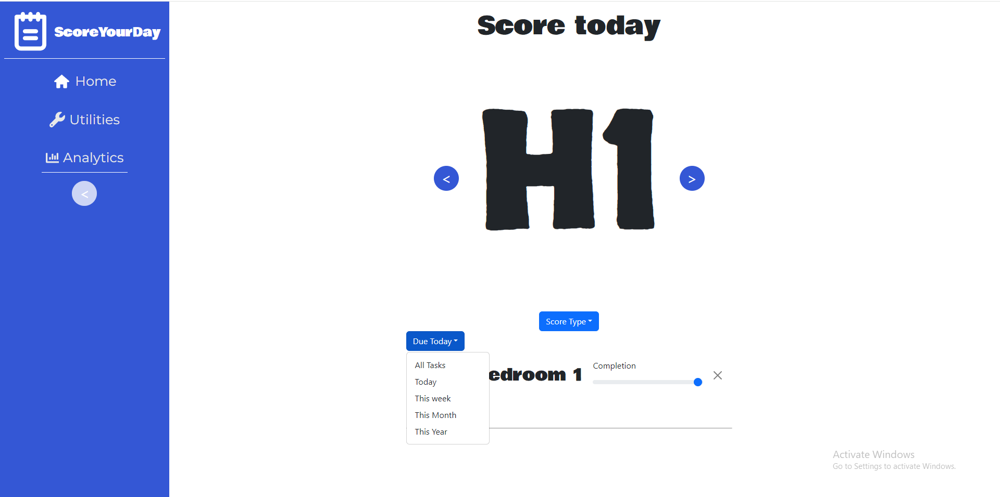
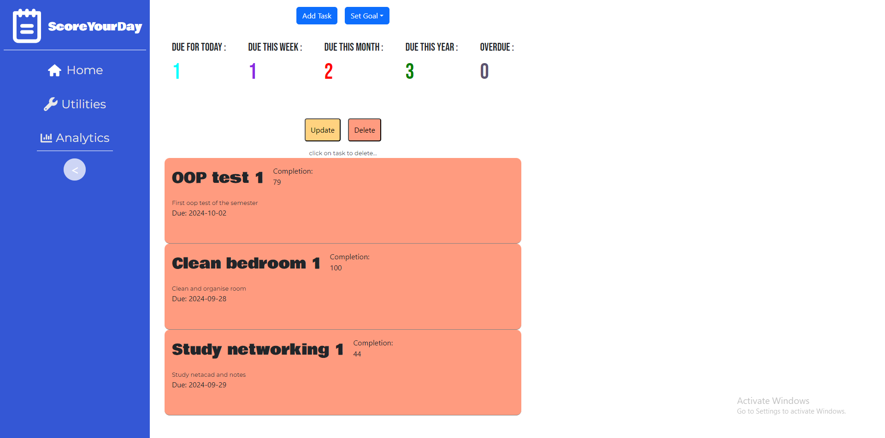
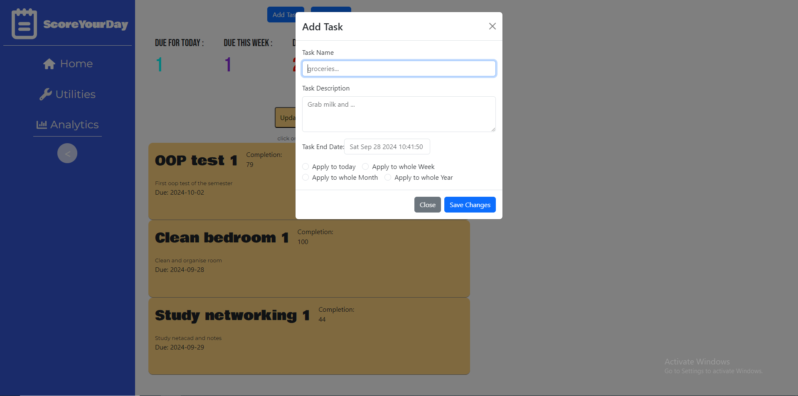
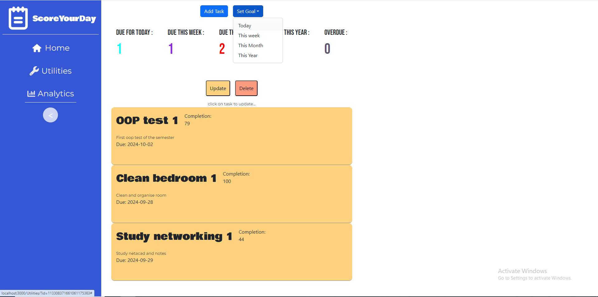
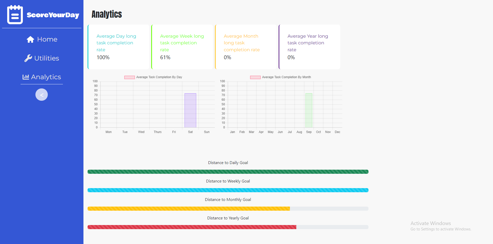

# ScoreYourDay
### Built with
* [![React][React.js]][React-url]
* [![Sping][SpringBoot]][SpringBoot-url]
* [![Postgres][Postgresql]][Postgresql-url]
* [![java][Java]][Java-url]

# About the Project

This project is a tool for students, or anyone to keep track of, not only their tasks but the progress they have made in each of their tasks.
It provides users with a simple and friendly UI and easy to use components.
You can also dynamically make tasks for each day of the week, month or year. As well as providing analytics on what days, weeks and months the user performs well on and doesnt perform well. 
The implementation of a test score rating motivates users to maintain a high score each day by completing each of their tasks with a 100% score.

### Key Features:
- **Add tasks dynamically**: Users can add the same task to each day of the week, month or year.
- **Test Score View**: Users can view their current score in their desired test score format in the landing page.
- **Analytics**: Users can see how well they do on each day of the week or month of the year, and also see how close they are to their target score.

# Usage
#### After signing in and arriving at the landing page, you will see a score, you can click the arrows adjacent to it to view your score for the week, month, year and day. Below that you will see your tasks, and hovering over them will expand the task and show the task description and end date. You can also change the completion of the task here, by using the slider.

#### You can also change how you view your score, by clicking on the score type, and selecting one of the values in the dropdown.

#### By clicking on the Due date dropdown you can filter your task by All, day, week, month and year.

#### To go to the utilities section, simply click on the Utilities icon or text in the sidebar. This is the page where you will be able to manipulate your tasks. To delete a task click on the delete button and click on the task you want to delete. Alternatively, to update a task, you can click on the update button and click on whichever task you want to update, this will then show you a popup in which you can change the description, name and due date.

#### You can add a task by clicking on the add task button at the top of the page. This will open a popup in which you can set the tasks name and description. You can also set the due date of the task and dynamically multiply the task to each day of the week, month or year.

#### You can also, set a goal for each day, week, month and year by clicking on the set goal button at the top of the page and choosing which from the dropdowns.

#### To view analytics click on the analytics section in the sidebar. This page will give you information on the score of the length of tasks, it will also show your average by day and by month, and finnaly it will display how far you are away from reaching your daily, weekly, monthly and yearly goal.

## Contact
#### Afolabi Adekanle - afolabiadekanle@gmail.com - [![linkedin][linked-in]][LinkedIn-url]

<!-- MARKDOWN LINKS & IMAGES -->
[React.js]: https://img.shields.io/badge/React-20232A?style=for-the-badge&logo=react&logoColor=61DAFB
[React-url]: https://reactjs.org/
[Postgresql]:https://img.shields.io/badge/postgresql-4169e1?style=for-the-badge&logo=postgresql&logoColor=white
[Postgresql-url]:https://www.postgresql.org/
[SpringBoot]:https://img.shields.io/badge/SpringBoot-6DB33F?style=flat-square&logo=Spring&logoColor=white
[SpringBoot-url]:https://spring.io/
[Java]:https://img.shields.io/badge/Java-ED8B00?style=for-the-badge&logo=openjdk&logoColor=white
[Java-url]:https://www.java.com/en/
[linked-in]: https://img.shields.io/badge/LinkedIn-0077B5?style=for-the-badge&logo=linkedin&logoColor=white
[LinkedIn-url]: https://www.linkedin.com/in/afolabi-adekanle-68428b1b6/

